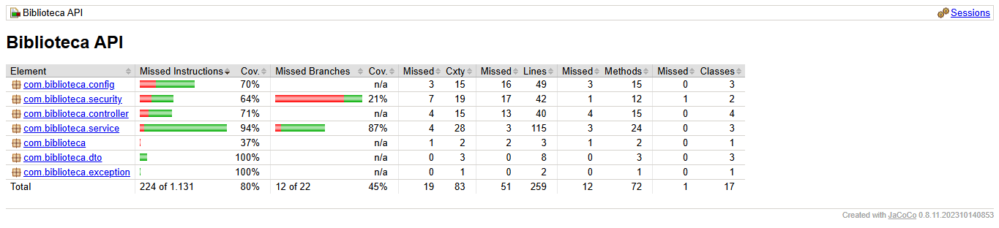
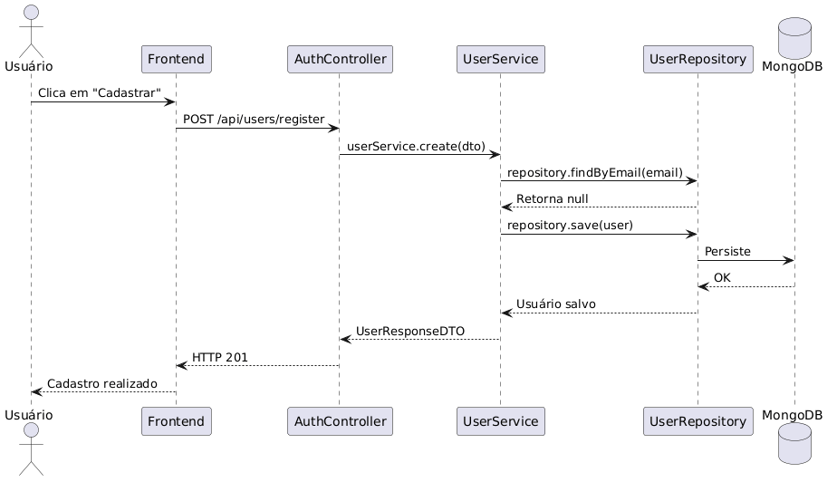
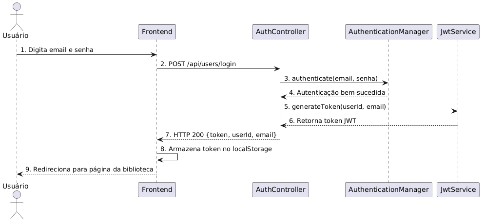
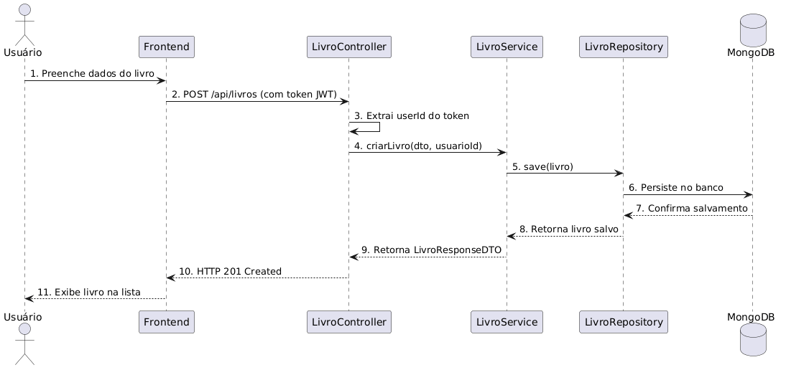

# 📚 Gerenciador de Biblioteca Pessoal

[](https://adoptium.net/)
[](https://spring.io/projects/spring-boot)
[](https://www.mongodb.com/)
[](https://www.jacoco.org/)
[](https://sonarcloud.io/)

Sistema completo para gerenciamento de biblioteca pessoal com autenticação JWT, CRUD de livros e persistência em MongoDB. Desenvolvido com Spring Boot no backend e HTML/CSS/JS no frontend.

---

## ✅ Funcionalidades

- Cadastro e autenticação de usuários com JWT
- Gerenciamento de sessão
- CRUD completo de livros
- Interface web responsiva
- Persistência em MongoDB

---

## 🛠️ Tecnologias

| Tecnologia | Versão |
|------------|--------|
| Java | 17.0.18 (Temurin) |
| Spring Boot | 4.0.3 |
| Maven | 3.9.12 |
| MongoDB | Latest (Docker) |
| Docker | 29.2.1 |
| JUnit | 5.12.1 |
| JaCoCo | 0.8.11 |
| SonarCloud | SaaS |

---

## 📋 Pré-requisitos

- [Java 17+](https://adoptium.net/)
- [Docker Desktop](https://www.docker.com/products/docker-desktop/)
- [VS Code](https://code.visualstudio.com/) com extensão Live Server
- Git

---

## 🚀 Como Executar

### 1. Clone o repositório

```bash
git clone https://github.com/Gcz14/Gerenciador-de-Biblioteca.git
cd Gerenciador-de-Biblioteca
```

### 2. Inicie o MongoDB com Docker

```bash
docker run -d --name mongodb-biblioteca -p 27017:27017 mongo:latest
docker ps
```

### 3. Execute o Backend

```bash
cd biblioteca
.\mvnw.cmd spring-boot:run
```

> O backend estará disponível em: `http://localhost:9999`

### 4. Execute o Frontend

1. Abra a pasta `frontend` no VS Code
2. Clique com o botão direito no `index.html`
3. Selecione **"Open with Live Server"**

---

## 🧪 Testes

### Executar todos os testes

```bash
cd biblioteca
.\mvnw.cmd test
```

### Executar um teste específico

```bash
.\mvnw.cmd test -Dtest=NomeDoTeste
```

### Gerar relatório de cobertura (JaCoCo)

```bash
cd biblioteca
.\mvnw.cmd test jacoco:report
```

> Relatório disponível em: `biblioteca/target/site/jacoco/index.html`

**Cobertura atual: 80% ✅**

---

## 📡 Endpoints da API

### Usuários

| Método | Endpoint | Descrição |
|--------|----------|-----------|
| `POST` | `/api/users/register` | Cadastrar usuário |
| `POST` | `/api/users/login` | Login (retorna token JWT) |
| `GET` | `/api/users/{id}` | Buscar usuário por ID |
| `PUT` | `/api/users/{id}` | Atualizar usuário |
| `DELETE` | `/api/users/{id}` | Deletar usuário |

### Livros *(requer token JWT)*

| Método | Endpoint | Descrição |
|--------|----------|-----------|
| `POST` | `/api/livros` | Criar livro |
| `GET` | `/api/livros` | Listar livros do usuário |
| `GET` | `/api/livros/{id}` | Buscar livro por ID |
| `PUT` | `/api/livros/{id}` | Atualizar livro |
| `DELETE` | `/api/livros/{id}` | Deletar livro |

---

## 📁 Estrutura do Projeto

```
Gerenciador-de-Biblioteca/
├── biblioteca/                 # Backend Spring Boot
│   ├── src/main/java/...       # Código fonte
│   ├── src/test/java/...       # Testes
│   └── pom.xml                 # Dependências
├── frontend/                   # Frontend HTML/CSS/JS
│   ├── index.html
│   ├── style.css
│   └── script.js
├── .github/workflows/          # CI/CD
├── README.md
└── RTM.md                      # Matriz de rastreabilidade
```

---

## 📊 Qualidade e CI/CD

- **SonarCloud** — análise estática de código
- **GitHub Actions** — pipeline automatizado (build, testes, cobertura)
- **JaCoCo** — relatório de cobertura (80%)
- **Testcontainers** — testes de integração com MongoDB real (sem mocks)

---

### 📊 Relatório de Cobertura



---

## 📐 Diagramas UML de Sequência

### Cadastro de Usuário


### Login


### Criar Livro


---

## 👨‍💻 Autores

- **Guilherme Ribeiro** — [@Gcz14](https://github.com/Gcz14)
- **Geovana Oliveira da Silva** — [@Giholliveiraa](https://github.com/Giholliveiraa)

---

## 📄 Licença

Projeto acadêmico — Semestre Letivo 2026.1
**Disciplina:** Qualidade de Software — Prof. Afonso Lelis